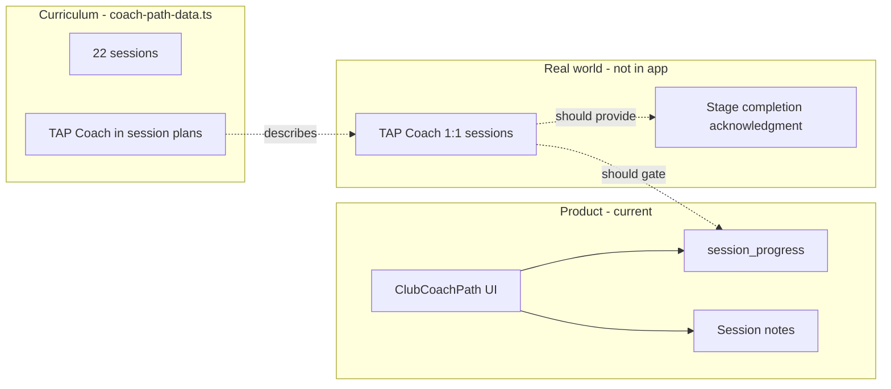
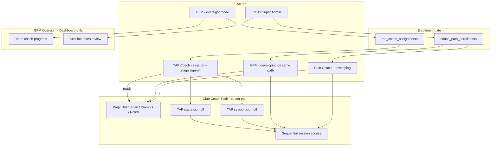
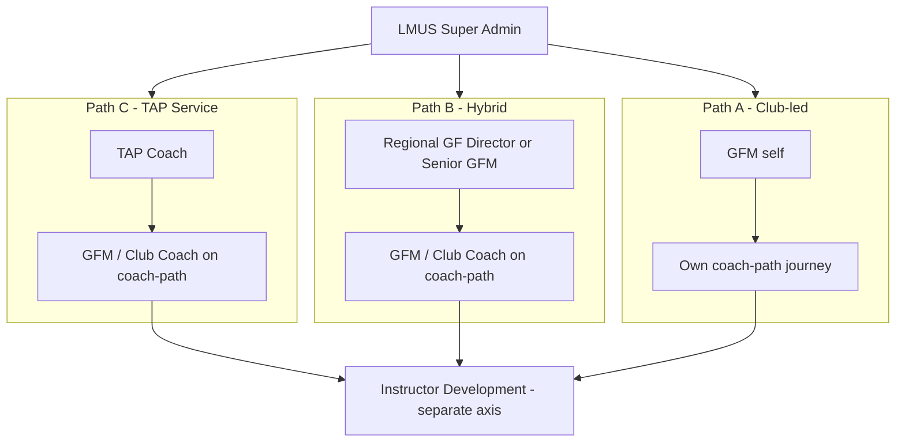
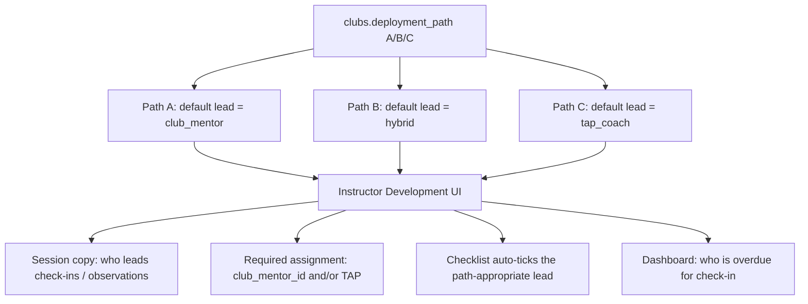

# Club Coach Pathway & TAP Access — Assessment Plan

> **For agentic workers:** REQUIRED SUB-SKILL: Use superpowers:subagent-driven-development (recommended) or superpowers:executing-plans to implement this plan task-by-task. Steps use checkbox (`- [ ]`) syntax for tracking.

**Goal:** Decide whether Club Coach needs its own defined pathway with dedicated access controls aligned to TAP-guided development, and close the gaps between curriculum intent and product behaviour.

**Architecture:** Club Coach already has a **content pathway** (`coach-path`) separate from instructor development (`development-pathway`). **Enrollment is LMUS Super Admin–initiated** — a user is not on the coach path until LMUS enrolls them and assigns a TAP Coach. **TAP Coaches log into this app** with their own role: view assigned coaches' prep notes, club observations, assessments, and development feedback; **contribute TAP debrief/feedback** on coach-path sessions where curriculum calls for it; and **sign off per session and per stage**. Actor model: **LMUS Super Admin** → **developing person** (Club Coach or GFM) → **TAP Coach** (in-app mentor) → **GFM oversight** (read team progress/notes).

**Tech Stack:** React 18, TypeScript, Vite, Supabase (Auth, RLS, Postgres), existing `session_progress` + `coach-path-data.ts`

---

## Executive Answer

### Does Club Coach need its own defined pathway?

**Yes — and you already have one.** The Club Coach Path (`path_key: 'coach-path'`) is a well-defined 5-stage curriculum (~22 sessions) in `src/data/coach-path-data.ts`, with its own UI (`ClubCoachPath.tsx`), progress table, and sidebar entry separate from Instructor Development.

What you **do not** have is a pathway that behaves like the curriculum describes: sequential, TAP-gated, mentor-led development.

### Does it need its own access?

**Partially yes.** Today:

| Layer | Current state | Curriculum expects |
|-------|---------------|-------------------|
| **Navigation** | Separate sidebar item ✓ | Separate journey ✓ |
| **Progress storage** | `session_progress` keyed by `coach-path` ✓ | Per-coach tracking ✓ |
| **Session locking** | UI exists; `isSessionLocked` always returns `false` ✗ | Sequential unlock within stage |
| **Enrollment** | Any club member can open coach-path ✗ | LMUS Super Admin enrolls user; assigns TAP ✗ |
| **TAP sign-off** | Self-mark complete ✗ | Per session + per stage by TAP ✗ |
| **Coach stage** | Hardcoded `coachStage: 1` on Dashboard ✗ | Derived from progress / TAP sign-off |
| **TAP assignment** | `tapCoachId?` on type only ✗ | Each coach has a TAP Coach |
| **Roles** | Club Coach = GFM (same permissions); title is display-only | GFM is **both** pathway participant and team overseer; TAP guides development |
| **Deployment path** | `clubs.deployment_path` A/B/C stored, unused | May affect mentor vs TAP-led instructor dev |

**Bottom line:** You need **pathway governance**, not a second pathway. The `coach-path` content model is sound. What's missing is the **TAP-mediated access layer** that makes the pathway trustworthy as a credentialing journey rather than a self-serve playbook.

---

## How TAP Drives Club Coach Today



Almost every Club Coach Path session specifies:

- **Format:** `1:1 with TAP Coach`
- **Session plans** name TAP actions (walkthrough, debrief, feedback)
- **HOW steps** tell the coach to report back to TAP
- **S5-4** explicitly requires TAP formal acknowledgment of pathway completion

The app is positioned as a **prep and reference tool between live TAP sessions**. That positioning is valid — but only if you add lightweight TAP touchpoints in the product. Without them, coaches can skip ahead, self-certify, and GFMs see misleading progress.

---

## Gap Analysis — What You're Missing

### 1. TAP is content, not workflow (critical)

| Missing capability | Why it matters |
|--------------------|----------------|
| LMUS enrollment gate | Any club member can open coach-path today; should require LMUS enrollment |
| TAP user role / login | TAP cannot sign off sessions or stages; no in-app presence ✗ |
| `coach_path_enrollments` table | No record of who LMUS enrolled |
| `tap_coach_assignments` table | No link between enrollment and TAP mentor |
| `coach_path_stage_signoffs` table | Stage transitions have no TAP gate |
| TAP session acknowledgment | Progress is self-certified |
| TAP visibility into club observations | Cannot read assessments, development notes, or instructor feedback ✗ |
| TAP contribution surfaces | Curriculum asks TAP to debrief/give feedback; no field for TAP input ✗ |

### 2. Pathway integrity is broken (high)

| Issue | Location | Impact |
|-------|----------|--------|
| `isSessionLocked` no-op | `ClubCoachPath.tsx:1130` | Coaches access any session |
| `coachStage` hardcoded to 1 | `Dashboard.tsx:90` | Progress panel lies about stage |
| No stage derivation | — | Stage badge never reflects reality |
| Self-service "Mark Complete" | `SessionProgressContext` | No external validation |

The plan in `2026-05-03-coach-progress-dashboard-and-session-locking.md` addressed locking with mock state; Supabase integration landed progress persistence but locking was stubbed out.

### 3. GFM dual-role not reflected in UI (high — blocks Phase 1)

**Product decision (confirmed):** A GFM must be able to:

1. **Participate** on Club Coach Path exactly like a Club Coach (prep, notes, mark sessions, sequential locking)
2. **Oversee** Club Coaches' pathway progress and session notes at the club

These are two modes on the **same** `coach-path` — not a separate GFM curriculum.

| Capability | Club Coach | GFM | Current app |
|------------|------------|-----|-------------|
| Complete own `coach-path` sessions | ✓ | ✓ | ✓ (data model supports; UI shows self only) |
| Read own session notes | ✓ | ✓ | ✓ |
| See all club coaches' pathway progress | ✗ | ✓ | ✗ Dashboard shows logged-in user only |
| Read all club coaches' session notes | ✗ | ✓ | ~ Partial (`SessionNotesReviewPanel` exists) |
| Distinguish "my path" vs "team oversight" on Dashboard | — | ✓ | ✗ Single undifferentiated Coach Progress card |

Additional blockers:

- `user_clubs` RLS allows users to read **only their own** membership — GFMs cannot list co-members to build an oversight roster (`001_initial_schema.sql`)
- `CoachProgressPanel` "Prep" always navigates to the logged-in user's path, not a selected coach's context
- Page subtitle: "Your development as a Club Coach" — excludes GFM-as-participant framing

### 4. Two pathways, one permission model (medium)

Club Coach Path and Instructor Development share club membership access. That's correct for GFMs who do both. Remaining edge cases:

- Les Mills wants coach-path enrollment to be TAP-initiated (optional future gate)
- Deployment path C uses TAP-led instructor dev but coach-path is club-self-serve

### 5. Instructor pathway TAP references are disconnected (medium)

In `stage-sessions.ts`, TAP appears for certification review, Club Mentor vs TAP Coach choice, and presenter levels. The app has:

- `assessorRole: 'coach' | 'tap' | 'gfm'` in types — always stored as `'coach'`
- No TAP assessment workflow
- No Club Mentor assignment UI

Club Coach (coach development) and Instructor Development (coaching others) are parallel journeys but TAP's role differs: **mentor to the coach** vs **certification authority for instructors**. The product should reflect both without conflating them.

### 6. Operational gaps (lower but real)

| Gap | Notes |
|-----|-------|
| No URL routing | Can't deep-link to a session for TAP prep |
| `deployment_path` unused | A/B/C club models not reflected in content or access |
| Orphaned mock data | `mock-data.ts` coaches array unused; stale `COACH_STAGE_DATA` |
| Admin = single email | No Les Mills ops role for TAP assignment at scale |

---

## Recommended Model: Three Actors, One Coach Path

Do **not** create a third `path_key` or a separate "GFM path". Extend governance on `coach-path` and split the **Dashboard UX** into participant vs oversight surfaces.



### LMUS enrollment + TAP sign-off (confirmed)

**Enrollment is not automatic.** A Club Coach or GFM only enters the coach development journey when **LMUS Super Admin** enrolls them. LMUS then **initiates TAP** by assigning a TAP Coach to that enrollment.

**TAP signs off at two levels:**

| Level | Who triggers prep | Who signs off | Unlocks |
|-------|-------------------|---------------|---------|
| **Session** | Coach/GFM marks "Prepped for TAP Session" after 1:1 | TAP Coach | Next session in stage |
| **Stage** | All sessions in stage are TAP-confirmed | TAP Coach | First session of next stage |

Until LMUS enrolls a user, the Club Coach Path nav item shows an **enrollment-pending** state (no session access). Until TAP is assigned, enrolled users see **awaiting TAP assignment**.

### TAP Coach in-app role (confirmed)

**TAP Coaches are full app users** provisioned by LMUS (`app_role = 'tap_coach'`). They log in with email + password like other roles and see a **TAP-focused shell** (not the Club Coach operations dashboard).

| Capability | Scope | Notes |
|------------|-------|-------|
| **View assigned coaches** | Coaches/GFMs with active `tap_coach_assignments` | Primary work queue |
| **View coach-path prep notes** | `session_progress.notes` for assigned coaches | Coach's reflection before/after 1:1 |
| **Add TAP session feedback** | `session_progress.tap_feedback` for assigned coaches | Debrief, coaching points, answers to session prompts |
| **Session sign-off** | Sets `completion_status = 'tap_confirmed'` | Unlocks next session |
| **Stage sign-off** | Inserts `coach_path_stage_signoffs` | Unlocks next stage |
| **View observations & feedback** | `assessments`, `development_notes` for clubs of assigned coaches | Read-only; see what coach observed in the field |
| **View instructor context** | `instructors`, grades, profiles in those clubs | Supports debrief sessions (e.g. S1-4 observation review) |
| **Contribute on instructor work** | Optional Phase 2b: TAP-authored `development_notes` or assessments with `assessor_role = 'tap'` | Where certification/observation content expects TAP input |

TAP does **not** get GFM oversight powers (club-wide coach monitoring) unless they are also a GFM account. TAP visibility is **assignment-scoped**: only clubs/coaches LMUS linked via enrollment.

**Coach-path session UX (dual pane when TAP opens a session):**

```
┌─────────────────────────────────────────────────────┐
│ Session S1-4 — Observation Debrief                  │
├──────────────────────┬──────────────────────────────┤
│ Coach prep notes     │ TAP debrief & feedback        │
│ (read-only for TAP)  │ (editable by TAP)             │
├──────────────────────┴──────────────────────────────┤
│ [Sign off session]  (enabled when feedback saved)     │
└─────────────────────────────────────────────────────┘
```

Coach sees TAP feedback on their session after debrief (read-only on coach side).

### GFM dual-role (confirmed)

| Mode | When | What they do in the app |
|------|------|-------------------------|
| **Participant** | GFM is being coached by TAP (same as Club Coach) | Full `coach-path` access **once LMUS enrolled + TAP assigned** |
| **Oversight** | GFM manages club coach development | Dashboard: all club coaches' stage/progress, session notes review, no editing others' progress |

`profiles.title` (`'Club Coach'` | `'GFM'`) remains **display-only** for permissions. Use it only to **show/hide oversight UI** — never to block a GFM from `coach-path`.

Progress is always keyed by **`user_id` + `club_id` + `path_key`** — a GFM's own journey and a Club Coach's journey are independent rows in `session_progress`, even in the same club.

### Access tiers (proposed)

| Role | Enroll in coach-path | Own Club Coach Path | Oversee team coach-path | TAP assignment | Instructor Development |
|------|---------------------|---------------------|-------------------------|----------------|------------------------|
| **Club Coach** | — (LMUS enrolls) | Participant once enrolled | — | — | Full access |
| **GFM** | — (LMUS enrolls) | Participant once enrolled | Read progress + notes | — | Full access |
| **TAP Coach** | — | Read assigned; write `tap_feedback` + sign-off | — | Assigned coaches only | Read observations, dev notes, assessments; optional TAP-authored notes |
| **LMUS Super Admin** | Enroll any user; assign TAP | — | All clubs (ops view) | Assign TAP ↔ coach | Provision accounts |

### Completion states (proposed)

Replace boolean `completed` with explicit session and stage status:

```sql
-- On session_progress (per session)
alter table public.session_progress
  add column if not exists completion_status text not null default 'not_started'
    check (completion_status in ('not_started', 'prepped', 'tap_confirmed')),
  add column if not exists tap_feedback text not null default '',
  add column if not exists tap_feedback_at timestamptz,
  add column if not exists tap_feedback_by uuid references public.profiles(id);

-- New: stage-level TAP sign-off
create table if not exists public.coach_path_stage_signoffs (
  id uuid primary key default gen_random_uuid(),
  user_id uuid not null references public.profiles(id) on delete cascade,
  club_id uuid not null references public.clubs(id) on delete cascade,
  stage_number int not null check (stage_number between 1 and 5),
  signed_off_by uuid not null references public.profiles(id),
  signed_off_at timestamptz not null default now(),
  unique (user_id, club_id, stage_number)
);

-- New: LMUS-initiated enrollment
create table if not exists public.coach_path_enrollments (
  id uuid primary key default gen_random_uuid(),
  user_id uuid not null references public.profiles(id) on delete cascade,
  club_id uuid not null references public.clubs(id) on delete cascade,
  enrolled_by uuid not null references public.profiles(id),
  enrolled_at timestamptz not null default now(),
  status text not null default 'active'
    check (status in ('active', 'paused', 'completed', 'withdrawn')),
  unique (user_id, club_id)
);
```

**Locking rules:**

1. User must have `coach_path_enrollments.status = 'active'` to access any session
2. Session N+1 unlocks when session N is `tap_confirmed`
3. Stage S+1 session 1 unlocks when stage S has `coach_path_stage_signoffs` row **and** all sessions in stage S are `tap_confirmed`
4. Coach marks `prepped` after 1:1; TAP moves to `tap_confirmed`

**Phase 1 interim:** Sequential locking among `tap_confirmed` sessions only (honor system for `prepped` → `tap_confirmed` until Phase 2 TAP UI ships). Enrollment gate ships in Phase 2 with LMUS admin.

---

## Decision Matrix

| Option | Pros | Cons | Recommendation |
|--------|------|------|----------------|
| **A. Content-only (status quo)** | Simple, no TAP login | Curriculum lies; no credential integrity | ✗ Don't stay here |
| **B. Self-serve locking only** | Quick win; matches partial 2026-05-03 plan | TAP still invisible; honor system | Phase 1 only |
| **C. TAP as external (email/export)** | No TAP auth build | Manual, doesn't scale | Stopgap at best |
| **D. TAP role + assignment + acknowledgment** | Matches curriculum; trustworthy pathway | More schema + UX | ✓ Target state |
| **E. Separate TAP product** | Clean separation | Overkill for 22 sessions | ✗ |

**Recommended path:** **Phase 0 (GFM dual-role) → Phase 1 (locking) → Phase 2 (TAP)**.

---

## Phase 0 — GFM Dual-Role (before locking)

Establish participant + oversight UX so Phase 1 locking applies correctly to both Club Coaches and GFMs. Estimated scope: 3 tasks, 1 small migration.

### Task 0: RLS — club members can list co-members

**Files:**
- Create: `supabase/migrations/005_club_member_roster.sql`

GFMs need to query who belongs to their club. Today `user_clubs` is owner-read-only.

- [ ] **Step 1: Add read policy for club co-members**

```sql
-- supabase/migrations/005_club_member_roster.sql
create policy "club members can read co-member user_clubs"
  on public.user_clubs for select using (
    club_id in (select club_id from public.user_clubs where user_id = auth.uid())
  );
```

- [ ] **Step 2: Apply migration locally / in Supabase SQL editor**

- [ ] **Step 3: Commit**

```bash
git add supabase/migrations/005_club_member_roster.sql
git commit -m "feat: allow club members to read co-member roster for GFM oversight"
```

### Task 0b: Club coach roster + progress context

**Files:**
- Create: `src/lib/club-coaches.ts`
- Create: `src/context/ClubCoachRosterContext.tsx`
- Modify: `src/App.tsx` (wrap provider)

- [ ] **Step 1: Fetch club coaches for active club**

```ts
// src/lib/club-coaches.ts
import { supabase } from '@/lib/supabase';
import type { UserProfile } from '@/context/AuthContext';

export interface ClubCoachMember {
  id: string;
  name: string;
  initials: string;
  title: 'Club Coach' | 'GFM';
}

export async function fetchClubCoaches(clubId: string): Promise<ClubCoachMember[]> {
  const { data: memberships, error: memError } = await supabase
    .from('user_clubs')
    .select('user_id')
    .eq('club_id', clubId);

  if (memError || !memberships?.length) return [];

  const userIds = memberships.map((m) => m.user_id);
  const { data: profiles } = await supabase
    .from('profiles')
    .select('id, name, initials, title')
    .in('id', userIds);

  return (profiles ?? []).map((p) => ({
    id: p.id,
    name: p.name,
    initials: p.initials,
    title: p.title as 'Club Coach' | 'GFM',
  }));
}
```

- [ ] **Step 2: Context loads roster + all club `session_progress` for `coach-path`**

Query `session_progress` where `club_id = activeClub.id` and `path_key = 'coach-path'`. Build `completedSessionIds: Record<userId, string[]>` for the whole club (RLS already allows this per migration `003`).

- [ ] **Step 3: Commit**

```bash
git add src/lib/club-coaches.ts src/context/ClubCoachRosterContext.tsx src/App.tsx
git commit -m "feat: load club coach roster and team coach-path progress"
```

### Task 0c: Split Dashboard — My Path vs Team Oversight

**Files:**
- Modify: `src/pages/Dashboard.tsx`
- Modify: `src/components/CoachProgressPanel.tsx`
- Modify: `src/components/SessionNotesReviewPanel.tsx`
- Modify: `src/App.tsx` (`PAGE_TITLES` for coach-path subtitle)

- [ ] **Step 1: Dashboard shows two sections when `profile.title === 'GFM'`**

```tsx
{/* My Club Coach Path — always shown */}
<CoachProgressPanel
  title="My Club Coach Path"
  coaches={[myCoachEntry]}
  completedSessionIds={completedSessionIds}
  onPrepSession={() => onNavigate('coach-path')}
  showPrepButton
/>

{/* Team oversight — GFM only */}
{profile?.title === 'GFM' && (
  <>
    <CoachProgressPanel
      title="Team Coach Development"
      coaches={teamCoachesExcludingSelf}
      completedSessionIds={clubCompletedSessionIds}
      showPrepButton={false}
    />
    <SessionNotesReviewPanel title="Team Session Notes" />
  </>
)}
```

- [ ] **Step 2: Add optional `title` and `showPrepButton` props to `CoachProgressPanel`**

Club Coaches see only "My Club Coach Path" (one row). GFMs see their own row plus all other club coaches in "Team Coach Development" (read-only progress, no Prep button on team rows).

- [ ] **Step 3: Update coach-path page subtitle**

In `App.tsx`, change subtitle to: `'Your development journey'` (works for Club Coach and GFM).

- [ ] **Step 4: Verify in browser**

| User | Expected Dashboard |
|------|-------------------|
| Club Coach | My Club Coach Path (self) + Session Notes Review (club-wide notes — existing) |
| GFM | My Club Coach Path (self) + Team Coach Development (all coaches) + Team Session Notes |

- [ ] **Step 5: Commit**

```bash
git add src/pages/Dashboard.tsx src/components/CoachProgressPanel.tsx src/components/SessionNotesReviewPanel.tsx src/App.tsx
git commit -m "feat: GFM dual-role dashboard with my path and team oversight"
```

---

## Phase 1 — Pathway Integrity (interim locking)

Restore progress display accuracy. **Full enrollment + TAP gates ship in Phase 2.** Phase 1 locking is sequential among completed sessions as an interim step; replace with `tap_confirmed` + stage sign-off in Phase 2.

### Task 1: Enforce sequential session locking

**Files:**
- Modify: `src/pages/ClubCoachPath.tsx:1130-1132`
- Test: manual browser verification

- [ ] **Step 1: Replace stub `isSessionLocked`**

```tsx
function isSessionLocked(
  sessionIndex: number,
  sessions: { id: string }[],
  completedIds: string[],
): boolean {
  if (sessionIndex === 0) return false;
  for (let i = 0; i < sessionIndex; i++) {
    if (!completedIds.includes(sessions[i].id)) return true;
  }
  return false;
}
```

- [ ] **Step 2: Verify lock UI in browser**

Run: `pnpm dev` → Club Coach Path → confirm only first incomplete session in each stage is accessible.

- [ ] **Step 3: Commit**

```bash
git add src/pages/ClubCoachPath.tsx
git commit -m "fix: enforce sequential session locking on Club Coach Path"
```

### Task 2: Derive coach stage from session progress

**Files:**
- Create: `src/lib/coach-path-progress.ts`
- Modify: `src/pages/Dashboard.tsx`
- Modify: `src/components/CoachProgressPanel.tsx`
- Modify: `src/context/ClubCoachRosterContext.tsx` (team rows use derived stage)

- [ ] **Step 1: Add stage derivation helper**

```ts
// src/lib/coach-path-progress.ts
import { coachPathStages } from '@/data/coach-path-data';

export function deriveCoachStage(completedIds: string[]): number {
  let stage = 1;
  for (const stageNum of [1, 2, 3, 4, 5] as const) {
    const sessions = coachPathStages[stageNum]?.sessions ?? [];
    const allDone = sessions.length > 0 && sessions.every((s) => completedIds.includes(s.id));
    if (allDone) stage = Math.min(stageNum + 1, 5);
  }
  return stage;
}
```

- [ ] **Step 2: Use `deriveCoachStage()` for every coach row (self + team)**

Replace hardcoded `coachStage: 1` in Dashboard's synthetic coach object. In Team Coach Development, derive stage per `user_id` from `clubCompletedSessionIds`.

- [ ] **Step 3: Commit**

```bash
git add src/lib/coach-path-progress.ts src/pages/Dashboard.tsx src/components/CoachProgressPanel.tsx
git commit -m "feat: derive coach stage from session progress"
```

### Task 3: Distinguish "Prep complete" copy from "TAP confirmed"

**Files:**
- Modify: `src/pages/ClubCoachPath.tsx` (Mark Complete button label + helper text)

- [ ] **Step 1: Update button copy**

Change "Mark Session Complete" → "Mark Prepped for TAP Session" with subtext: "Your TAP Coach will confirm completion after your 1:1."

- [ ] **Step 2: Commit**

```bash
git add src/pages/ClubCoachPath.tsx
git commit -m "copy: clarify mark-complete as prep, not TAP certification"
```

### Task 4: Add deep link support for session prep (optional quick win)

**Files:**
- Modify: `src/App.tsx`

- [ ] **Step 1: Read `?page=coach-path&session=S1-2` from URL on load**

- [ ] **Step 2: Commit**

```bash
git add src/App.tsx
git commit -m "feat: deep-link to Club Coach Path session"
```

---

## Phase 2 — LMUS Enrollment + TAP Sign-Off (target state)

### Task 5: Schema — roles, enrollments, assignments, sign-offs

**Files:**
- Create: `supabase/migrations/006_lmus_enrollment_and_tap.sql` (renumbered — `005` is club roster RLS)

- [ ] **Step 1: Add `app_role` to profiles**

```sql
alter table public.profiles
  add column if not exists app_role text not null default 'club_coach'
    check (app_role in ('club_coach', 'gfm', 'tap_coach', 'lmus_admin'));
```

Map existing `VITE_ADMIN_EMAIL` user to `lmus_admin` on first login or via seed migration. `lmus_admin` replaces the single-email admin check over time.

- [ ] **Step 2: Create `coach_path_enrollments`**

```sql
create table if not exists public.coach_path_enrollments (
  id uuid primary key default gen_random_uuid(),
  user_id uuid not null references public.profiles(id) on delete cascade,
  club_id uuid not null references public.clubs(id) on delete cascade,
  enrolled_by uuid not null references public.profiles(id),
  enrolled_at timestamptz not null default now(),
  status text not null default 'active'
    check (status in ('active', 'paused', 'completed', 'withdrawn')),
  unique (user_id, club_id)
);
```

Only `lmus_admin` can insert/update. Enrolled users can read own row.

- [ ] **Step 3: Create `tap_coach_assignments`**

```sql
create table if not exists public.tap_coach_assignments (
  id uuid primary key default gen_random_uuid(),
  enrollment_id uuid not null references public.coach_path_enrollments(id) on delete cascade,
  tap_coach_user_id uuid not null references public.profiles(id) on delete cascade,
  assigned_by uuid not null references public.profiles(id),
  assigned_at timestamptz not null default now(),
  active boolean not null default true,
  unique (enrollment_id)
);
```

LMUS assigns TAP when enrolling (or immediately after). One active TAP per enrollment.

- [ ] **Step 4: Add `completion_status` + `coach_path_stage_signoffs`**

(See Completion states section above.)

- [ ] **Step 5: RLS policies**

| Table | LMUS admin | TAP coach | Coach/GFM | GFM oversight |
|-------|------------|-----------|-----------|---------------|
| `coach_path_enrollments` | CRUD all | Read assigned | Read own | Read club |
| `tap_coach_assignments` | CRUD all | Read own assignments | Read own | Read club |
| `session_progress` | Read all | Read/write assigned (`notes` read, `tap_feedback` write, confirm) | Read/write own (`notes`, `prepped`) | Read club |
| `coach_path_stage_signoffs` | Read all | Insert for assigned | Read own | Read club |
| `assessments` | Read all | Read clubs of assigned coaches | CRUD own club | CRUD own club |
| `development_notes` | Read all | Read clubs of assigned coaches; optional insert as TAP | CRUD own club | CRUD own club |
| `instructors` + grades | Read all | Read clubs of assigned coaches | CRUD own club | CRUD own club |

- [ ] **Step 6: Commit**

```bash
git add supabase/migrations/006_lmus_enrollment_and_tap.sql
git commit -m "feat: LMUS enrollment, TAP assignment, session and stage sign-offs"
```

### Task 6: LMUS Super Admin — enroll + assign TAP

**Files:**
- Create: `src/pages/LmusAdminPanel.tsx`
- Modify: `src/App.tsx`, `src/components/layout/Sidebar.tsx`, `src/context/AuthContext.tsx`

- [ ] **Step 1: Replace `isAdmin` email check with `profile.app_role === 'lmus_admin'`** (keep email fallback during migration)

- [ ] **Step 2: Admin panel: select user + club → Enroll in Club Coach Path → Assign TAP Coach**

Workflow: LMUS picks a Club Coach or GFM at a club, clicks **Enroll**, then selects a TAP Coach from `profiles` where `app_role = 'tap_coach'`. LMUS also provisions TAP accounts via **Add Coach** (extended to support `tap_coach` role).

- [ ] **Step 3: Show enrollment status on user list (active / paused / completed)**

- [ ] **Step 4: Commit**

```bash
git add src/pages/LmusAdminPanel.tsx src/App.tsx src/components/layout/Sidebar.tsx src/context/AuthContext.tsx
git commit -m "feat: LMUS Super Admin enrolls users and assigns TAP coaches"
```

### Task 7: Enrollment gate on Club Coach Path

**Files:**
- Create: `src/context/CoachPathEnrollmentContext.tsx`
- Modify: `src/pages/ClubCoachPath.tsx`, `src/components/layout/Sidebar.tsx`

- [ ] **Step 1: Load enrollment + TAP assignment for active user/club**

- [ ] **Step 2: If not enrolled → show "Enrollment pending — contact LMUS" empty state (no sessions)**

- [ ] **Step 3: If enrolled but no TAP → show "Awaiting TAP Coach assignment"**

- [ ] **Step 4: If enrolled + TAP assigned → normal path UI**

- [ ] **Step 5: Commit**

```bash
git add src/context/CoachPathEnrollmentContext.tsx src/pages/ClubCoachPath.tsx src/components/layout/Sidebar.tsx
git commit -m "feat: gate Club Coach Path on LMUS enrollment and TAP assignment"
```

### Task 8: TAP Coach app shell + dashboard

**Files:**
- Create: `src/pages/TapCoachDashboard.tsx`
- Create: `src/components/layout/TapSidebar.tsx`
- Modify: `src/App.tsx`, `src/context/AuthContext.tsx`

- [ ] **Step 1: Route TAP users to TAP shell after login** (`profile.app_role === 'tap_coach'`)

TAP sidebar (assignment-scoped):
- **My Coaches** — dashboard
- **Instructor Context** — read-only roster/assessments/notes for clubs of assigned coaches

Club Coach / GFM / LMUS keep existing sidebar.

- [ ] **Step 2: Dashboard — assigned coaches with stage, sessions awaiting sign-off, latest prep notes**

- [ ] **Step 3: Deep-link into coach-path session in TAP review mode** (read coach `notes`, edit `tap_feedback`)

- [ ] **Step 4: Commit**

```bash
git add src/pages/TapCoachDashboard.tsx src/components/layout/TapSidebar.tsx src/App.tsx src/context/AuthContext.tsx
git commit -m "feat: TAP Coach login shell and assigned-coach dashboard"
```

### Task 9: TAP sign-off + feedback on coach-path sessions

**Files:**
- Modify: `src/context/SessionProgressContext.tsx`
- Modify: `src/pages/TapCoachDashboard.tsx`
- Modify: `src/pages/ClubCoachPath.tsx`
- Create: `src/components/TapSessionReviewPanel.tsx`

- [ ] **Step 1: Add `saveTapFeedback` and `confirmSession` to SessionProgressContext** (TAP role only, assigned coaches)

```ts
async function saveTapFeedback(
  coachUserId: string,
  sessionId: string,
  tapFeedback: string,
): Promise<void> {
  // upsert session_progress for coachUserId with tap_feedback, tap_feedback_by, tap_feedback_at
}

async function confirmSession(coachUserId: string, sessionId: string): Promise<void> {
  // set completion_status = 'tap_confirmed' — require tap_feedback non-empty for sessions
  //   where coach-path session has format including TAP debrief (default: all sessions)
}
```

- [ ] **Step 2: `TapSessionReviewPanel` — coach prep notes (read-only) + TAP feedback textarea + Sign off session**

- [ ] **Step 3: On ClubCoachPath, show TAP feedback section when `tap_feedback` exists** (read-only for coach/GFM)

- [ ] **Step 4: `confirmStage(coachUserId, stageNumber)` — stage sign-off when all sessions `tap_confirmed`**

- [ ] **Step 5: Update `isSessionLocked`** (require `tap_confirmed` on prior session AND stage sign-off before next stage)

- [ ] **Step 6: Commit**

```bash
git add src/context/SessionProgressContext.tsx src/pages/TapCoachDashboard.tsx src/pages/ClubCoachPath.tsx src/components/TapSessionReviewPanel.tsx
git commit -m "feat: TAP session feedback and sign-off on coach-path"
```

### Task 10: TAP read access to observations & instructor feedback

**Files:**
- Modify: `supabase/migrations/006_lmus_enrollment_and_tap.sql` (TAP RLS policies)
- Create: `src/pages/TapInstructorContext.tsx`
- Modify: `src/hooks/useAssessments.ts`, `src/context/DataContext.tsx` (optional TAP-scoped fetch)

- [ ] **Step 1: RLS helper — TAP can read rows where `club_id` in assigned coaches' clubs**

```sql
create or replace function public.tap_assigned_club_ids()
returns setof uuid language sql stable security definer as $$
  select distinct e.club_id
  from public.coach_path_enrollments e
  join public.tap_coach_assignments t on t.enrollment_id = e.id
  where t.tap_coach_user_id = auth.uid() and t.active and e.status = 'active';
$$;

create policy "tap coaches read assigned club assessments"
  on public.assessments for select using (
    club_id in (select public.tap_assigned_club_ids())
  );

create policy "tap coaches read assigned club development_notes"
  on public.development_notes for select using (
    club_id in (select public.tap_assigned_club_ids())
  );
```

- [ ] **Step 2: `TapInstructorContext` page — instructor list for assigned clubs with links to assessments + development notes** (read-only)

- [ ] **Step 3: From TAP coach dashboard, link "View field observations" for a coach's club**

- [ ] **Step 4: Commit**

```bash
git add supabase/migrations/006_lmus_enrollment_and_tap.sql src/pages/TapInstructorContext.tsx src/hooks/useAssessments.ts
git commit -m "feat: TAP read access to observations and development feedback"
```

### Task 11 (optional): TAP-authored instructor contributions

**Files:**
- Modify: `src/data/types.ts`, `supabase/migrations/007_tap_assessor.sql`
- Modify: `src/pages/AssessmentCenter.tsx` or new `TapAddObservation.tsx`

Only if Les Mills wants TAP to **write** instructor observations in-app (not just read). Defer unless required for certification workflow.

- [ ] **Step 1: Add `assessor_role` column to `assessments`** (persist `'coach' | 'tap' | 'gfm'`)

- [ ] **Step 2: TAP can create observation-type assessments for instructors in assigned clubs**

- [ ] **Step 3: Commit**

```bash
git add supabase/migrations/007_tap_assessor.sql src/pages/TapAddObservation.tsx
git commit -m "feat: TAP-authored observations for assigned clubs"
```

---

## What NOT to build (YAGNI)

- **A second coach pathway or "GFM path"** — GFMs use `coach-path` as participants; oversight is a Dashboard view, not a curriculum
- **Blocking GFMs from coach-path** — title controls oversight UI visibility only
- **TAP proxy sign-off outside the app** — TAP logs in; no external tool needed
- **TAP-led instructor certification workflow** — defer; read access + optional TAP observations (Task 11) covers "add value" for v1
- **Full scheduling/calendar for TAP 1:1s** — out of scope; TAP sessions happen offline
- **Deployment path A/B/C branching** — Phase 3; path-aware copy + assignments, not content forks (see Deployment Path section)

---

## Deployment Path A/B/C — LMUS Service Tiers (Revised)

**Status:** Product framing from LMUS business model — **who develops GFMs and Club Coaches**, not only who develops instructors.

The earlier recommendation in this doc framed A/B/C as *instructor* development lead (Club Mentor vs TAP). That remains a **second axis**. The primary sales framing is:

| Path | LMUS sells… | Primary developer | App is used to… |
|------|-------------|-------------------|-----------------|
| **C — TAP service** | Dedicated TAP Coach developing your people | **TAP Coach** | Run coach-path 1:1s, debrief, sign off sessions/stages, view club observations |
| **B — Hybrid** | Platform + methodology; club/region delivers | **GFM or Regional GF Director** | Train and develop GFMs / Club Coaches on coach-path; oversee their progress |
| **A — Club-led** | Self-serve growth toolkit | **GFM (self)** | Own development on coach-path; grow capability without sold TAP hours |



### Two axes (don't conflate)

| Axis | Question | Paths |
|------|----------|-------|
| **1. Coach development tier** (this section) | Who develops GFMs / Club Coaches on `coach-path`? | A=self/club, B=GFD/GFM, C=TAP |
| **2. Instructor development lead** (below) | Who leads hands-on instructor work post-IT? | Often correlates with tier but not 1:1 |

A **Hybrid coach tier** club can still be Club-led for instructors (internal mentor). A **TAP service** club might have TAP develop coaches *and* lean on TAP more for instructor cert windows.

### Instructor development lead (secondary axis)

| Path | Who leads instructor hands-on dev | TAP role |
|------|-----------------------------------|----------|
| **A** | Club Mentor (in-club) | Plan + cert review; escalation |
| **B** | Club Mentor primary, TAP in loop | Sync + video review |
| **C** | TAP Coach | Weekly check-ins, drives cert windows |

Use `clubs.instructor_dev_lead` derived from tier defaults; LMUS can override per club.

### Sign-off authority by coach-development tier

The plan assumed TAP always signs off coach-path. **That only fits Path C.**

| Tier | Session prep by | Sign-off by | Stage sign-off by |
|------|-----------------|-------------|-------------------|
| **C — TAP service** | GFM / Club Coach | TAP Coach | TAP Coach |
| **B — Hybrid** | GFM / Club Coach | **Regional GFD or mentoring GFM** | Same development lead |
| **A — Club-led** | GFM (self) | **Self-certify with integrity prompts**, or optional regional review | GFM marks stage complete; LMUS may audit |

Path A creates tension with `coach-path-data.ts` (every session says "1:1 with TAP Coach"). Options:

1. **Path-aware copy** — "1:1 with your development lead" / "Reflection & self-assessment" on Path A
2. **Internal mentor as TAP-equivalent** — senior GFM or regional peer assigned as `development_lead_id` even on Path A
3. **Separate lighter curriculum** for Path A — **not recommended** (3× maintenance)

Recommend **(2) for B** and **(1)+(optional regional audit) for A**.

### What you're missing (gaps vs this business model)

| Gap | Why it matters |
|-----|----------------|
| **Regional GF Director role** | Hybrid tier names RGD as primary developer — no `regional_gfd` role, no multi-club scope, no RGD dashboard |
| **Generic `development_lead`** | Sign-off can't always be TAP — need `development_lead_id` + `development_lead_type` (`tap` \| `gfd` \| `gfm` \| `self`) per enrollment |
| **Enrollment initiator varies by tier** | C: LMUS enrolls + assigns TAP. B: RGD/GFM enrolls coaches they develop. A: GFM self-enrolls or LMUS opens club tier |
| **Developer mode (not just oversight)** | Hybrid GFD/GFM must do what TAP does on Path C: read prep, write feedback, sign off — not only read notes on Dashboard |
| **Cross-club visibility** | Regional GFD sees GFMs/club coaches across multiple clubs in their region |
| **Org / region hierarchy** | `regions` → `clubs` → `users`; LMUS ops at top — today flat `clubs` only |
| **Commercial metadata** | `service_tier`, seat limits, TAP hours, feature flags — not in schema |
| **Coach tier vs instructor tier** | One club might need different defaults on each axis — single `deployment_path` field is insufficient |
| **Club-led sign-off without TAP** | Phase 2 is TAP-only; Path A needs alternate completion workflow |
| **Curriculum voice on Path A** | 109× "TAP Coach" strings need path-aware rendering |
| **Provisioning chain** | Who creates GFM accounts at each tier; who can invite Club Coaches |
| **LMUS audit / quality** | LMUS needs cross-tier visibility for quality assurance without doing every sign-off |
| **Instructor pathway on Path A** | GFM growing self on coach-path still needs to develop instructors — Club Mentor model on instructor axis |

### Recommended schema evolution

```sql
-- Replace single deployment_path semantics with explicit tiers
alter table public.clubs
  add column if not exists coach_dev_tier text not null default 'club_led'
    check (coach_dev_tier in ('club_led', 'hybrid', 'tap_service')),
  add column if not exists instructor_dev_lead text not null default 'club_mentor'
    check (instructor_dev_lead in ('club_mentor', 'hybrid', 'tap_coach'));

-- Enrollment carries who develops this person
alter table public.coach_path_enrollments
  add column if not exists development_lead_type text not null default 'tap_coach'
    check (development_lead_type in ('tap_coach', 'regional_gfd', 'gfm', 'self')),
  add column if not exists development_lead_id uuid references public.profiles(id);
```

Keep `deployment_path` A/B/C as legacy display mapping: `A→club_led`, `B→hybrid`, `C→tap_service` until LMUS renames in UI.

### Implementation phasing (revised)

| Phase | Work |
|-------|------|
| **0–1** | GFM dual-role + locking (unchanged) |
| **2** | Path **C only**: LMUS enrollment, TAP login, TAP sign-off, `tap_feedback` |
| **2b** | Path **B**: `regional_gfd` role, development lead sign-off, multi-club RGD dashboard, GFM developer mode |
| **3** | Path **A**: self-serve coach-path, path-aware curriculum copy, optional regional audit |
| **3b** | Instructor dev lead axis: `club_mentor_id`, path-aware instructor session copy |

**YAGNI:** Ship Path C (TAP service) first — it matches the curriculum as written and the highest-value LMUS SKU. Hybrid and Club-led layers need the `development_lead` abstraction before they work honestly.

---

## Deployment Path A/B/C — Instructor Lead Detail (Original)

**Status:** Recommended model (confirm exact LMUS labels with ops team).

The codebase stores `clubs.deployment_path` (`'A' | 'B' | 'C'`) and displays it on the club picker, but **does not define what each path means**. The instructor curriculum (`stage-sessions.ts`) repeatedly asks: *"Confirm whether a Club Mentor or TAP Coach will lead hands-on development."* That binary is what A/B/C should configure — **not a third copy of the curriculum**.

### Recommended definitions

| Path | Name | Who leads instructor hands-on dev | TAP role | Typical club profile |
|------|------|-----------------------------------|----------|----------------------|
| **A** | **Club-led** | **Club Mentor** (in-club experienced instructor) | TAP-designed plan + certification review; TAP steps in only on escalation | Mature club, strong internal mentor bench (e.g. mock `Westside` — 22 instructors, 3 coaches) |
| **B** | **Hybrid** (default) | **Club Mentor primary**, TAP in the loop | TAP plan + scheduled sync/check-ins; TAP may review videos remotely | Most clubs — club owns rhythm, TAP ensures plan fidelity (e.g. mock `Midtown`) |
| **C** | **TAP-led** | **TAP Coach** (regional/remote hands-on) | TAP runs weekly check-ins, observes (live or video), drives 30-day / post-cert windows | Smaller clubs or limited mentor capacity (e.g. mock `Downtown` — 8 instructors, 1 coach) |

### What deployment path should **not** change

| Area | Behaviour across A/B/C |
|------|--------------------------|
| **Club Coach Path** (`coach-path`) | Always LMUS enrollment + TAP 1:1 + TAP session/stage sign-off. Curriculum is TAP-driven regardless of club path. |
| **GFM dual-role** | Unchanged — GFM can be on coach-path and oversee team. |
| **Instructor Development curriculum** | **One** `stage-sessions.ts` library. No Path A/B/C content forks. |
| **LMQ / Assessment framework** | Same standards; only *who leads* differs. |

### What deployment path **should** change (product behaviour)

Use `deployment_path` as **club configuration** that drives defaults and UI — not separate YAML/TS content trees.



**1. Default development lead per club**

Add a derived or stored field (recommend derive first, persist if LMUS overrides per club):

```ts
// src/lib/deployment-path.ts
export type InstructorDevLead = 'club_mentor' | 'hybrid' | 'tap_coach';

export function defaultInstructorDevLead(path: DeploymentPath): InstructorDevLead {
  switch (path) {
    case 'A': return 'club_mentor';
    case 'B': return 'hybrid';
    case 'C': return 'tap_coach';
  }
}
```

**2. Instructor-level assignment (required before Stage 2+ sessions unlock)**

| Path | Required before post-IT work | UI |
|------|------------------------------|-----|
| A | `instructors.club_mentor_id` (FK → another instructor) | Pick mentor from club roster |
| B | Club Mentor **and** TAP visibility on plan | Mentor primary; TAP assignment at club level |
| C | Active TAP assignment for club/coach | TAP Coach named; Club Coach = logistics + context |

Schema addition (Phase 3 or folded into Phase 2):

```sql
alter table public.instructors
  add column if not exists club_mentor_id uuid references public.instructors(id);

alter table public.clubs
  add column if not exists instructor_dev_lead text
    check (instructor_dev_lead in ('club_mentor', 'hybrid', 'tap_coach'));
-- default from deployment_path on insert; LMUS can override
```

**3. Contextual copy in Instructor Development (not new content)**

Sessions that today say *"Confirm whether a Club Mentor or TAP Coach will lead…"* should render path-aware helper text:

| Path | Rendered default |
|------|------------------|
| A | "Your club is **Path A (Club-led)**. Confirm the **Club Mentor** who will lead hands-on development. TAP reviews certification; escalate to TAP if the instructor stalls." |
| B | "Your club is **Path B (Hybrid)**. Confirm the **Club Mentor** leading day-to-day development. TAP stays aligned on the plan — note sync points in the instructor plan." |
| C | "Your club is **Path C (TAP-led)**. Confirm the **TAP Coach** leading hands-on development. Your role is club context, logistics, and supporting observations." |

Implement via a small `getDeploymentPathCopy(path, sessionId)` helper — **do not** triplicate `stage-sessions.ts`.

**4. Dashboard & accountability**

| Path | "Who is overdue?" widget |
|------|--------------------------|
| A | Club Mentor / Club Coach — weekly check-in on cert window instructors |
| B | Club Mentor first; flag to TAP if check-in missed 2 weeks |
| C | TAP Coach queue primary; Club Coach sees "awaiting TAP check-in" |

**5. TAP app visibility**

| Path | TAP Instructor Context tab |
|------|----------------------------|
| A | Read-only unless escalated or cert review |
| B | Active on assigned clubs — plan sync + video review |
| C | Primary operator — same as coach-path TAP workload for instructor dev |

### Implementation phasing

| Phase | Deployment path work |
|-------|---------------------|
| **0–1** | No change — ship GFM + locking first |
| **2** | LMUS sets `deployment_path` at club create; show path badge + 1-line description in club picker |
| **3** | `club_mentor_id`, path-aware session copy, assignment gates on instructor development |
| **4** | Dashboard accountability widgets per path |

**YAGNI guardrail:** Do not build Path A/B/C until Phase 2 TAP + enrollment ship. Path is configuration on top of a working mentor/TAP model, not a prerequisite.

### Why this is the best fit

1. **Matches existing curriculum** — content already describes Club Mentor *or* TAP; A/B/C picks the default instead of asking every club to re-decide.
2. **Matches mock data intuition** — large club → A, mid → B, small/low coach count → C.
3. **Keeps coach-path clean** — coach development is always TAP-mediated; deployment path is an **instructor ops** knob.
4. **Avoids 3× content maintenance** — one session library, path-aware presentation layer.
5. **LMUS control** — path set at club provisioning; optional per-club override of `instructor_dev_lead` without renumbering A/B/C.

---

## Open Questions for Product Owner

**Resolved:**

- **Enrollment:** LMUS Super Admin initiates coach-path enrollment (not automatic, not self-serve).
- **TAP assignment:** LMUS initiates TAP Coach assignment at enrollment.
- **Sign-off:** TAP signs off **per session** and **per stage**.
- **GFM dual-role:** GFMs complete `coach-path` like Club Coaches and oversee team development (Phase 0).
- **TAP login:** TAP Coaches are full app users with assignment-scoped access.
- **TAP visibility:** TAP reads coach prep notes, club assessments, development notes, and instructor context for assigned coaches' clubs.
- **TAP contribution:** TAP writes `tap_feedback` on coach-path sessions and signs off sessions/stages.
- **Deployment path A/B/C:** **Instructor Development lead model** (Club Mentor / Hybrid / TAP-led); does **not** change Club Coach Path. See section above. Confirm exact LMUS naming for A/B/C with ops.

---

## Self-Review

**Spec coverage:**
- [x] Assess whether dedicated pathway exists → Executive Answer
- [x] Assess whether dedicated access needed → Access tiers + Decision Matrix
- [x] GFM dual-role (participant + oversight) → Phase 0 + GFM dual-role section
- [x] LMUS enrollment + TAP per-session/per-stage sign-off → Phase 2 Tasks 5–9
- [x] TAP login + observations visibility + session feedback → TAP in-app role section + Tasks 8–10
- [x] TAP-driven guidance gap → Gap Analysis §1
- [x] What's missing → Gap Analysis §1–6
- [x] Actionable next steps → Phase 0 + Phase 1 + Phase 2 tasks

**Placeholder scan:** No TBD implementation steps in Phase 1. Phase 2 Task 4 (deep link) marked optional. Open Questions explicitly flagged for PO.

**Type consistency:** `completion_status` enum used consistently in Phase 2 Tasks 5 and 7. `deriveCoachStage` returns `CoachStage` compatible `number` 1–5.

---

## Summary for Stakeholders

| Question | Answer |
|----------|--------|
| Do you need a defined pathway? | **Already have it** (`coach-path`) |
| Do GFMs need their own pathway? | **No** — same `coach-path`; oversight is a Dashboard mode |
| Can GFMs complete coach-path like Club Coaches? | **Yes** — once LMUS enrolls them (Phase 0 UX + Phase 2 gate) |
| Is enrollment automatic? | **No** — LMUS Super Admin enrolls; then assigns TAP |
| How does TAP gate progression? | **Per session** (`tap_confirmed`) **and per stage** (`coach_path_stage_signoffs`) |
| Do you need separate access? | **Yes** — enrollment gate + TAP sign-off + GFM oversight (Phases 0–2) |
| Is TAP represented correctly? | **No** — Phase 2 adds TAP login, feedback, observations read, sign-off |
| Does TAP log into the app? | **Yes** — `tap_coach` role, assignment-scoped shell |
| What can TAP see? | Prep notes, assessments, development notes, instructors (assigned clubs) |
| What can TAP add? | Session `tap_feedback`, session/stage sign-off; optional instructor observations (Task 11) |
| Deployment path A/B/C? | **Instructor dev lead only** (A=club mentor, B=hybrid, C=TAP-led); coach-path unchanged |
| Build order | **Phase 0** (GFM oversight) → **Phase 1** (interim locking) → **Phase 2** (LMUS + TAP) |

The Club Coach product is a strong **playbook + club operations** tool. To become a **guided credentialing pathway** as the curriculum describes, it needs TAP in the workflow — not just in the words.
