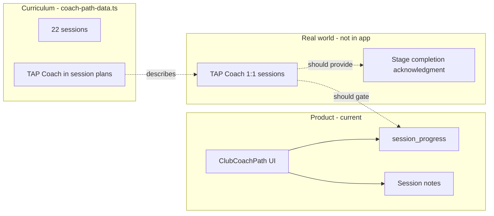
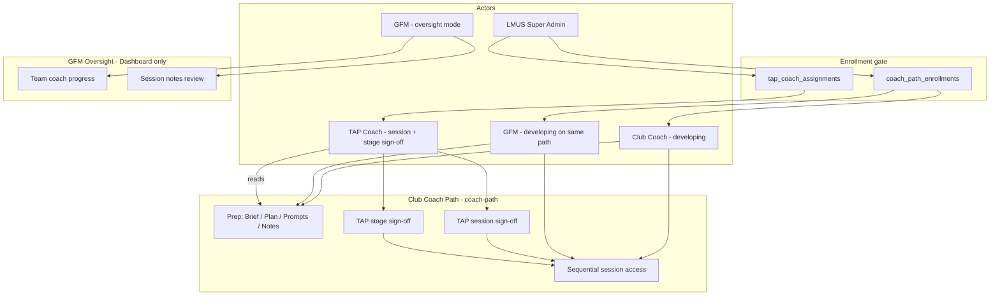

# Club Coach Pathway & TAP Access — Assessment Plan

> **For agentic workers:** REQUIRED SUB-SKILL: Use superpowers:subagent-driven-development (recommended) or superpowers:executing-plans to implement this plan task-by-task. Steps use checkbox (`- [ ]`) syntax for tracking.

**Goal:** Decide whether Club Coach needs its own defined pathway with dedicated access controls aligned to TAP-guided development, and close the gaps between curriculum intent and product behaviour.

**Architecture:** Club Coach already has a **content pathway** (`coach-path`) separate from instructor development (`development-pathway`). **Enrollment is LMUS Super Admin–initiated** — a user is not on the coach path until LMUS enrolls them and assigns a TAP Coach. TAP then **signs off per session and per stage** before progression unlocks. TAP is embedded in curriculum as the human mentor but has no product workflow yet. The actor model is: **LMUS Super Admin** (enroll + assign TAP) → **developing person** (Club Coach or GFM on `coach-path`) → **TAP Coach** (session + stage sign-off) → **GFM oversight** (read team progress/notes, separate from own path). Do not create a second pathway for GFMs.

**Tech Stack:** React 18, TypeScript, Vite, Supabase (Auth, RLS, Postgres), existing `session_progress` + `coach-path-data.ts`

---

## Executive Answer

### Does Club Coach need its own defined pathway?

**Yes — and you already have one.** The Club Coach Path (`path_key: 'coach-path'`) is a well-defined 5-stage curriculum (~22 sessions) in `src/data/coach-path-data.ts`, with its own UI (`ClubCoachPath.tsx`), progress table, and sidebar entry separate from Instructor Development.

What you **do not** have is a pathway that behaves like the curriculum describes: sequential, TAP-gated, mentor-led development.

### Does it need its own access?

**Partially yes.** Today:

| Layer | Current state | Curriculum expects |
|-------|---------------|-------------------|
| **Navigation** | Separate sidebar item ✓ | Separate journey ✓ |
| **Progress storage** | `session_progress` keyed by `coach-path` ✓ | Per-coach tracking ✓ |
| **Session locking** | UI exists; `isSessionLocked` always returns `false` ✗ | Sequential unlock within stage |
| **Enrollment** | Any club member can open coach-path ✗ | LMUS Super Admin enrolls user; assigns TAP ✗ |
| **TAP sign-off** | Self-mark complete ✗ | Per session + per stage by TAP ✗ |
| **Coach stage** | Hardcoded `coachStage: 1` on Dashboard ✗ | Derived from progress / TAP sign-off |
| **TAP assignment** | `tapCoachId?` on type only ✗ | Each coach has a TAP Coach |
| **Roles** | Club Coach = GFM (same permissions); title is display-only | GFM is **both** pathway participant and team overseer; TAP guides development |
| **Deployment path** | `clubs.deployment_path` A/B/C stored, unused | May affect mentor vs TAP-led instructor dev |

**Bottom line:** You need **pathway governance**, not a second pathway. The `coach-path` content model is sound. What's missing is the **TAP-mediated access layer** that makes the pathway trustworthy as a credentialing journey rather than a self-serve playbook.

---

## How TAP Drives Club Coach Today



Almost every Club Coach Path session specifies:

- **Format:** `1:1 with TAP Coach`
- **Session plans** name TAP actions (walkthrough, debrief, feedback)
- **HOW steps** tell the coach to report back to TAP
- **S5-4** explicitly requires TAP formal acknowledgment of pathway completion

The app is positioned as a **prep and reference tool between live TAP sessions**. That positioning is valid — but only if you add lightweight TAP touchpoints in the product. Without them, coaches can skip ahead, self-certify, and GFMs see misleading progress.

---

## Gap Analysis — What You're Missing

### 1. TAP is content, not workflow (critical)

| Missing capability | Why it matters |
|--------------------|----------------|
| TAP user role / login | TAP cannot see coach notes, approve sessions, or assign next work |
| `tap_coach_assignments` table | No link between developing coach and TAP mentor |
| TAP session acknowledgment | S5-4 and stage transitions are unenforceable |
| TAP visibility into prep notes | GFMs can read notes (`003` migration); TAP cannot |

### 2. Pathway integrity is broken (high)

| Issue | Location | Impact |
|-------|----------|--------|
| `isSessionLocked` no-op | `ClubCoachPath.tsx:1130` | Coaches access any session |
| `coachStage` hardcoded to 1 | `Dashboard.tsx:90` | Progress panel lies about stage |
| No stage derivation | — | Stage badge never reflects reality |
| Self-service "Mark Complete" | `SessionProgressContext` | No external validation |

The plan in `2026-05-03-coach-progress-dashboard-and-session-locking.md` addressed locking with mock state; Supabase integration landed progress persistence but locking was stubbed out.

### 3. GFM dual-role not reflected in UI (high — blocks Phase 1)

**Product decision (confirmed):** A GFM must be able to:

1. **Participate** on Club Coach Path exactly like a Club Coach (prep, notes, mark sessions, sequential locking)
2. **Oversee** Club Coaches' pathway progress and session notes at the club

These are two modes on the **same** `coach-path` — not a separate GFM curriculum.

| Capability | Club Coach | GFM | Current app |
|------------|------------|-----|-------------|
| Complete own `coach-path` sessions | ✓ | ✓ | ✓ (data model supports; UI shows self only) |
| Read own session notes | ✓ | ✓ | ✓ |
| See all club coaches' pathway progress | ✗ | ✓ | ✗ Dashboard shows logged-in user only |
| Read all club coaches' session notes | ✗ | ✓ | ~ Partial (`SessionNotesReviewPanel` exists) |
| Distinguish "my path" vs "team oversight" on Dashboard | — | ✓ | ✗ Single undifferentiated Coach Progress card |

Additional blockers:

- `user_clubs` RLS allows users to read **only their own** membership — GFMs cannot list co-members to build an oversight roster (`001_initial_schema.sql`)
- `CoachProgressPanel` "Prep" always navigates to the logged-in user's path, not a selected coach's context
- Page subtitle: "Your development as a Club Coach" — excludes GFM-as-participant framing

### 4. Two pathways, one permission model (medium)

Club Coach Path and Instructor Development share club membership access. That's correct for GFMs who do both. Remaining edge cases:

- Les Mills wants coach-path enrollment to be TAP-initiated (optional future gate)
- Deployment path C uses TAP-led instructor dev but coach-path is club-self-serve

### 5. Instructor pathway TAP references are disconnected (medium)

In `stage-sessions.ts`, TAP appears for certification review, Club Mentor vs TAP Coach choice, and presenter levels. The app has:

- `assessorRole: 'coach' | 'tap' | 'gfm'` in types — always stored as `'coach'`
- No TAP assessment workflow
- No Club Mentor assignment UI

Club Coach (coach development) and Instructor Development (coaching others) are parallel journeys but TAP's role differs: **mentor to the coach** vs **certification authority for instructors**. The product should reflect both without conflating them.

### 6. Operational gaps (lower but real)

| Gap | Notes |
|-----|-------|
| No URL routing | Can't deep-link to a session for TAP prep |
| `deployment_path` unused | A/B/C club models not reflected in content or access |
| Orphaned mock data | `mock-data.ts` coaches array unused; stale `COACH_STAGE_DATA` |
| Admin = single email | No Les Mills ops role for TAP assignment at scale |

---

## Recommended Model: Three Actors, One Coach Path

Do **not** create a third `path_key` or a separate "GFM path". Extend governance on `coach-path` and split the **Dashboard UX** into participant vs oversight surfaces.



### LMUS enrollment + TAP sign-off (confirmed)

**Enrollment is not automatic.** A Club Coach or GFM only enters the coach development journey when **LMUS Super Admin** enrolls them. LMUS then **initiates TAP** by assigning a TAP Coach to that enrollment.

**TAP signs off at two levels:**

| Level | Who triggers prep | Who signs off | Unlocks |
|-------|-------------------|---------------|---------|
| **Session** | Coach/GFM marks "Prepped for TAP Session" after 1:1 | TAP Coach | Next session in stage |
| **Stage** | All sessions in stage are TAP-confirmed | TAP Coach | First session of next stage |

Until LMUS enrolls a user, the Club Coach Path nav item shows an **enrollment-pending** state (no session access). Until TAP is assigned, enrolled users see **awaiting TAP assignment**.

### GFM dual-role (confirmed)

| Mode | When | What they do in the app |
|------|------|-------------------------|
| **Participant** | GFM is being coached by TAP (same as Club Coach) | Full `coach-path` access **once LMUS enrolled + TAP assigned** |
| **Oversight** | GFM manages club coach development | Dashboard: all club coaches' stage/progress, session notes review, no editing others' progress |

`profiles.title` (`'Club Coach'` | `'GFM'`) remains **display-only** for permissions. Use it only to **show/hide oversight UI** — never to block a GFM from `coach-path`.

Progress is always keyed by **`user_id` + `club_id` + `path_key`** — a GFM's own journey and a Club Coach's journey are independent rows in `session_progress`, even in the same club.

### Access tiers (proposed)

| Role | Enroll in coach-path | Own Club Coach Path | Oversee team coach-path | TAP assignment | Instructor Development |
|------|---------------------|---------------------|-------------------------|----------------|------------------------|
| **Club Coach** | — (LMUS enrolls) | Participant once enrolled | — | — | Full access |
| **GFM** | — (LMUS enrolls) | Participant once enrolled | Read progress + notes | — | Full access |
| **TAP Coach** | — | — | Read assigned coaches | — | Read-only (optional) |
| **LMUS Super Admin** | Enroll any user; assign TAP | — | All clubs (ops view) | Assign TAP ↔ coach | Provision accounts |

### Completion states (proposed)

Replace boolean `completed` with explicit session and stage status:

```sql
-- On session_progress (per session)
alter table public.session_progress
  add column if not exists completion_status text not null default 'not_started'
    check (completion_status in ('not_started', 'prepped', 'tap_confirmed'));

-- New: stage-level TAP sign-off
create table if not exists public.coach_path_stage_signoffs (
  id uuid primary key default gen_random_uuid(),
  user_id uuid not null references public.profiles(id) on delete cascade,
  club_id uuid not null references public.clubs(id) on delete cascade,
  stage_number int not null check (stage_number between 1 and 5),
  signed_off_by uuid not null references public.profiles(id),
  signed_off_at timestamptz not null default now(),
  unique (user_id, club_id, stage_number)
);

-- New: LMUS-initiated enrollment
create table if not exists public.coach_path_enrollments (
  id uuid primary key default gen_random_uuid(),
  user_id uuid not null references public.profiles(id) on delete cascade,
  club_id uuid not null references public.clubs(id) on delete cascade,
  enrolled_by uuid not null references public.profiles(id),
  enrolled_at timestamptz not null default now(),
  status text not null default 'active'
    check (status in ('active', 'paused', 'completed', 'withdrawn')),
  unique (user_id, club_id)
);
```

**Locking rules:**

1. User must have `coach_path_enrollments.status = 'active'` to access any session
2. Session N+1 unlocks when session N is `tap_confirmed`
3. Stage S+1 session 1 unlocks when stage S has `coach_path_stage_signoffs` row **and** all sessions in stage S are `tap_confirmed`
4. Coach marks `prepped` after 1:1; TAP moves to `tap_confirmed`

**Phase 1 interim:** Sequential locking among `tap_confirmed` sessions only (honor system for `prepped` → `tap_confirmed` until Phase 2 TAP UI ships). Enrollment gate ships in Phase 2 with LMUS admin.

---

## Decision Matrix

| Option | Pros | Cons | Recommendation |
|--------|------|------|----------------|
| **A. Content-only (status quo)** | Simple, no TAP login | Curriculum lies; no credential integrity | ✗ Don't stay here |
| **B. Self-serve locking only** | Quick win; matches partial 2026-05-03 plan | TAP still invisible; honor system | Phase 1 only |
| **C. TAP as external (email/export)** | No TAP auth build | Manual, doesn't scale | Stopgap at best |
| **D. TAP role + assignment + acknowledgment** | Matches curriculum; trustworthy pathway | More schema + UX | ✓ Target state |
| **E. Separate TAP product** | Clean separation | Overkill for 22 sessions | ✗ |

**Recommended path:** **Phase 0 (GFM dual-role) → Phase 1 (locking) → Phase 2 (TAP)**.

---

## Phase 0 — GFM Dual-Role (before locking)

Establish participant + oversight UX so Phase 1 locking applies correctly to both Club Coaches and GFMs. Estimated scope: 3 tasks, 1 small migration.

### Task 0: RLS — club members can list co-members

**Files:**
- Create: `supabase/migrations/005_club_member_roster.sql`

GFMs need to query who belongs to their club. Today `user_clubs` is owner-read-only.

- [ ] **Step 1: Add read policy for club co-members**

```sql
-- supabase/migrations/005_club_member_roster.sql
create policy "club members can read co-member user_clubs"
  on public.user_clubs for select using (
    club_id in (select club_id from public.user_clubs where user_id = auth.uid())
  );
```

- [ ] **Step 2: Apply migration locally / in Supabase SQL editor**

- [ ] **Step 3: Commit**

```bash
git add supabase/migrations/005_club_member_roster.sql
git commit -m "feat: allow club members to read co-member roster for GFM oversight"
```

### Task 0b: Club coach roster + progress context

**Files:**
- Create: `src/lib/club-coaches.ts`
- Create: `src/context/ClubCoachRosterContext.tsx`
- Modify: `src/App.tsx` (wrap provider)

- [ ] **Step 1: Fetch club coaches for active club**

```ts
// src/lib/club-coaches.ts
import { supabase } from '@/lib/supabase';
import type { UserProfile } from '@/context/AuthContext';

export interface ClubCoachMember {
  id: string;
  name: string;
  initials: string;
  title: 'Club Coach' | 'GFM';
}

export async function fetchClubCoaches(clubId: string): Promise<ClubCoachMember[]> {
  const { data: memberships, error: memError } = await supabase
    .from('user_clubs')
    .select('user_id')
    .eq('club_id', clubId);

  if (memError || !memberships?.length) return [];

  const userIds = memberships.map((m) => m.user_id);
  const { data: profiles } = await supabase
    .from('profiles')
    .select('id, name, initials, title')
    .in('id', userIds);

  return (profiles ?? []).map((p) => ({
    id: p.id,
    name: p.name,
    initials: p.initials,
    title: p.title as 'Club Coach' | 'GFM',
  }));
}
```

- [ ] **Step 2: Context loads roster + all club `session_progress` for `coach-path`**

Query `session_progress` where `club_id = activeClub.id` and `path_key = 'coach-path'`. Build `completedSessionIds: Record<userId, string[]>` for the whole club (RLS already allows this per migration `003`).

- [ ] **Step 3: Commit**

```bash
git add src/lib/club-coaches.ts src/context/ClubCoachRosterContext.tsx src/App.tsx
git commit -m "feat: load club coach roster and team coach-path progress"
```

### Task 0c: Split Dashboard — My Path vs Team Oversight

**Files:**
- Modify: `src/pages/Dashboard.tsx`
- Modify: `src/components/CoachProgressPanel.tsx`
- Modify: `src/components/SessionNotesReviewPanel.tsx`
- Modify: `src/App.tsx` (`PAGE_TITLES` for coach-path subtitle)

- [ ] **Step 1: Dashboard shows two sections when `profile.title === 'GFM'`**

```tsx
{/* My Club Coach Path — always shown */}
<CoachProgressPanel
  title="My Club Coach Path"
  coaches={[myCoachEntry]}
  completedSessionIds={completedSessionIds}
  onPrepSession={() => onNavigate('coach-path')}
  showPrepButton
/>

{/* Team oversight — GFM only */}
{profile?.title === 'GFM' && (
  <>
    <CoachProgressPanel
      title="Team Coach Development"
      coaches={teamCoachesExcludingSelf}
      completedSessionIds={clubCompletedSessionIds}
      showPrepButton={false}
    />
    <SessionNotesReviewPanel title="Team Session Notes" />
  </>
)}
```

- [ ] **Step 2: Add optional `title` and `showPrepButton` props to `CoachProgressPanel`**

Club Coaches see only "My Club Coach Path" (one row). GFMs see their own row plus all other club coaches in "Team Coach Development" (read-only progress, no Prep button on team rows).

- [ ] **Step 3: Update coach-path page subtitle**

In `App.tsx`, change subtitle to: `'Your development journey'` (works for Club Coach and GFM).

- [ ] **Step 4: Verify in browser**

| User | Expected Dashboard |
|------|-------------------|
| Club Coach | My Club Coach Path (self) + Session Notes Review (club-wide notes — existing) |
| GFM | My Club Coach Path (self) + Team Coach Development (all coaches) + Team Session Notes |

- [ ] **Step 5: Commit**

```bash
git add src/pages/Dashboard.tsx src/components/CoachProgressPanel.tsx src/components/SessionNotesReviewPanel.tsx src/App.tsx
git commit -m "feat: GFM dual-role dashboard with my path and team oversight"
```

---

## Phase 1 — Pathway Integrity (interim locking)

Restore progress display accuracy. **Full enrollment + TAP gates ship in Phase 2.** Phase 1 locking is sequential among completed sessions as an interim step; replace with `tap_confirmed` + stage sign-off in Phase 2.

### Task 1: Enforce sequential session locking

**Files:**
- Modify: `src/pages/ClubCoachPath.tsx:1130-1132`
- Test: manual browser verification

- [ ] **Step 1: Replace stub `isSessionLocked`**

```tsx
function isSessionLocked(
  sessionIndex: number,
  sessions: { id: string }[],
  completedIds: string[],
): boolean {
  if (sessionIndex === 0) return false;
  for (let i = 0; i < sessionIndex; i++) {
    if (!completedIds.includes(sessions[i].id)) return true;
  }
  return false;
}
```

- [ ] **Step 2: Verify lock UI in browser**

Run: `pnpm dev` → Club Coach Path → confirm only first incomplete session in each stage is accessible.

- [ ] **Step 3: Commit**

```bash
git add src/pages/ClubCoachPath.tsx
git commit -m "fix: enforce sequential session locking on Club Coach Path"
```

### Task 2: Derive coach stage from session progress

**Files:**
- Create: `src/lib/coach-path-progress.ts`
- Modify: `src/pages/Dashboard.tsx`
- Modify: `src/components/CoachProgressPanel.tsx`
- Modify: `src/context/ClubCoachRosterContext.tsx` (team rows use derived stage)

- [ ] **Step 1: Add stage derivation helper**

```ts
// src/lib/coach-path-progress.ts
import { coachPathStages } from '@/data/coach-path-data';

export function deriveCoachStage(completedIds: string[]): number {
  let stage = 1;
  for (const stageNum of [1, 2, 3, 4, 5] as const) {
    const sessions = coachPathStages[stageNum]?.sessions ?? [];
    const allDone = sessions.length > 0 && sessions.every((s) => completedIds.includes(s.id));
    if (allDone) stage = Math.min(stageNum + 1, 5);
  }
  return stage;
}
```

- [ ] **Step 2: Use `deriveCoachStage()` for every coach row (self + team)**

Replace hardcoded `coachStage: 1` in Dashboard's synthetic coach object. In Team Coach Development, derive stage per `user_id` from `clubCompletedSessionIds`.

- [ ] **Step 3: Commit**

```bash
git add src/lib/coach-path-progress.ts src/pages/Dashboard.tsx src/components/CoachProgressPanel.tsx
git commit -m "feat: derive coach stage from session progress"
```

### Task 3: Distinguish "Prep complete" copy from "TAP confirmed"

**Files:**
- Modify: `src/pages/ClubCoachPath.tsx` (Mark Complete button label + helper text)

- [ ] **Step 1: Update button copy**

Change "Mark Session Complete" → "Mark Prepped for TAP Session" with subtext: "Your TAP Coach will confirm completion after your 1:1."

- [ ] **Step 2: Commit**

```bash
git add src/pages/ClubCoachPath.tsx
git commit -m "copy: clarify mark-complete as prep, not TAP certification"
```

### Task 4: Add deep link support for session prep (optional quick win)

**Files:**
- Modify: `src/App.tsx`

- [ ] **Step 1: Read `?page=coach-path&session=S1-2` from URL on load**

- [ ] **Step 2: Commit**

```bash
git add src/App.tsx
git commit -m "feat: deep-link to Club Coach Path session"
```

---

## Phase 2 — LMUS Enrollment + TAP Sign-Off (target state)

### Task 5: Schema — roles, enrollments, assignments, sign-offs

**Files:**
- Create: `supabase/migrations/006_lm_us_enrollment_and_tap.sql` (renumbered — `005` is club roster RLS)

- [ ] **Step 1: Add `app_role` to profiles**

```sql
alter table public.profiles
  add column if not exists app_role text not null default 'club_coach'
    check (app_role in ('club_coach', 'gfm', 'tap_coach', 'lmus_admin'));
```

Map existing `VITE_ADMIN_EMAIL` user to `lmus_admin` on first login or via seed migration. `lmus_admin` replaces the single-email admin check over time.

- [ ] **Step 2: Create `coach_path_enrollments`**

```sql
create table if not exists public.coach_path_enrollments (
  id uuid primary key default gen_random_uuid(),
  user_id uuid not null references public.profiles(id) on delete cascade,
  club_id uuid not null references public.clubs(id) on delete cascade,
  enrolled_by uuid not null references public.profiles(id),
  enrolled_at timestamptz not null default now(),
  status text not null default 'active'
    check (status in ('active', 'paused', 'completed', 'withdrawn')),
  unique (user_id, club_id)
);
```

Only `lmus_admin` can insert/update. Enrolled users can read own row.

- [ ] **Step 3: Create `tap_coach_assignments`**

```sql
create table if not exists public.tap_coach_assignments (
  id uuid primary key default gen_random_uuid(),
  enrollment_id uuid not null references public.coach_path_enrollments(id) on delete cascade,
  tap_coach_user_id uuid not null references public.profiles(id) on delete cascade,
  assigned_by uuid not null references public.profiles(id),
  assigned_at timestamptz not null default now(),
  active boolean not null default true,
  unique (enrollment_id)
);
```

LMUS assigns TAP when enrolling (or immediately after). One active TAP per enrollment.

- [ ] **Step 4: Add `completion_status` + `coach_path_stage_signoffs`**

(See Completion states section above.)

- [ ] **Step 5: RLS policies**

| Table | LMUS admin | TAP coach | Coach/GFM | GFM oversight |
|-------|------------|-----------|-----------|---------------|
| `coach_path_enrollments` | CRUD all | Read assigned | Read own | Read club |
| `tap_coach_assignments` | CRUD all | Read own assignments | Read own | Read club |
| `session_progress` | Read all | Read/write assigned (confirm) | Read/write own (prepped) | Read club |
| `coach_path_stage_signoffs` | Read all | Insert for assigned | Read own | Read club |

- [ ] **Step 6: Commit**

```bash
git add supabase/migrations/006_lm_us_enrollment_and_tap.sql
git commit -m "feat: LMUS enrollment, TAP assignment, session and stage sign-offs"
```

### Task 6: LMUS Super Admin — enroll + assign TAP

**Files:**
- Create: `src/pages/LmusAdminPanel.tsx`
- Modify: `src/App.tsx`, `src/components/layout/Sidebar.tsx`, `src/context/AuthContext.tsx`

- [ ] **Step 1: Replace `isAdmin` email check with `profile.app_role === 'lmus_admin'`** (keep email fallback during migration)

- [ ] **Step 2: Admin panel: select user + club → Enroll in Club Coach Path → Assign TAP Coach**

Workflow: LMUS picks a Club Coach or GFM at a club, clicks **Enroll**, then selects a TAP Coach from `profiles` where `app_role = 'tap_coach'`.

- [ ] **Step 3: Show enrollment status on user list (active / paused / completed)**

- [ ] **Step 4: Commit**

```bash
git add src/pages/LmusAdminPanel.tsx src/App.tsx src/components/layout/Sidebar.tsx src/context/AuthContext.tsx
git commit -m "feat: LMUS Super Admin enrolls users and assigns TAP coaches"
```

### Task 7: Enrollment gate on Club Coach Path

**Files:**
- Create: `src/context/CoachPathEnrollmentContext.tsx`
- Modify: `src/pages/ClubCoachPath.tsx`, `src/components/layout/Sidebar.tsx`

- [ ] **Step 1: Load enrollment + TAP assignment for active user/club**

- [ ] **Step 2: If not enrolled → show "Enrollment pending — contact LMUS" empty state (no sessions)**

- [ ] **Step 3: If enrolled but no TAP → show "Awaiting TAP Coach assignment"**

- [ ] **Step 4: If enrolled + TAP assigned → normal path UI**

- [ ] **Step 5: Commit**

```bash
git add src/context/CoachPathEnrollmentContext.tsx src/pages/ClubCoachPath.tsx src/components/layout/Sidebar.tsx
git commit -m "feat: gate Club Coach Path on LMUS enrollment and TAP assignment"
```

### Task 8: TAP Coach dashboard — session + stage sign-off

**Files:**
- Create: `src/pages/TapCoachDashboard.tsx`
- Modify: `src/context/SessionProgressContext.tsx`
- Modify: `src/pages/ClubCoachPath.tsx`

- [ ] **Step 1: List assigned coaches with stage, sessions awaiting sign-off, latest prep notes**

- [ ] **Step 2: `confirmSession(coachUserId, sessionId)` — sets `completion_status = 'tap_confirmed'`**

- [ ] **Step 3: `confirmStage(coachUserId, stageNumber)` — inserts `coach_path_stage_signoffs` row** (enabled only when all sessions in stage are `tap_confirmed`)

- [ ] **Step 4: Update `isSessionLocked` to require `tap_confirmed` on prior session AND stage sign-off before next stage**

```tsx
function isSessionLocked(
  stageNum: number,
  sessionIndex: number,
  sessions: { id: string }[],
  progressBySessionId: Record<string, CompletionStatus>,
  stageSignoffs: Set<number>,
): boolean {
  if (!isEnrolled) return true;
  if (stageNum > 1 && !stageSignoffs.has(stageNum - 1)) return true;
  if (sessionIndex === 0) return false;
  const priorId = sessions[sessionIndex - 1].id;
  return progressBySessionId[priorId] !== 'tap_confirmed';
}
```

- [ ] **Step 5: Commit**

```bash
git add src/pages/TapCoachDashboard.tsx src/context/SessionProgressContext.tsx src/pages/ClubCoachPath.tsx
git commit -m "feat: TAP session and stage sign-off gates progression"
```

---

## What NOT to build (YAGNI)

- **A second coach pathway or "GFM path"** — GFMs use `coach-path` as participants; oversight is a Dashboard view, not a curriculum
- **Blocking GFMs from coach-path** — title controls oversight UI visibility only
- **TAP-led instructor certification in v1 of TAP role** — keep instructor TAP references in content; certification workflow is Assessment Centre scope
- **Full scheduling/calendar for TAP 1:1s** — out of scope; TAP sessions happen offline
- **Deployment path A/B/C branching** — until Les Mills defines behaviour per path in a spec

---

## Open Questions for Product Owner

Before Phase 2 engineering, confirm with Les Mills:

1. **Will TAP Coaches log into this app**, or should sign-off happen via a separate Les Mills ops tool?
2. **Deployment path A/B/C** — does it change who leads coach development (club mentor vs TAP)?

**Resolved:**

- **Enrollment:** LMUS Super Admin initiates coach-path enrollment (not automatic, not self-serve).
- **TAP assignment:** LMUS initiates TAP Coach assignment at enrollment.
- **Sign-off:** TAP signs off **per session** and **per stage**.
- **GFM dual-role:** GFMs complete `coach-path` like Club Coaches and oversee team development (Phase 0).

---

## Self-Review

**Spec coverage:**
- [x] Assess whether dedicated pathway exists → Executive Answer
- [x] Assess whether dedicated access needed → Access tiers + Decision Matrix
- [x] LMUS enrollment + TAP per-session/per-stage sign-off → LMUS enrollment section + Phase 2 Tasks 5–8
- [x] TAP-driven guidance gap → Gap Analysis §1
- [x] What's missing → Gap Analysis §1–6
- [x] Actionable next steps → Phase 0 + Phase 1 + Phase 2 tasks

**Placeholder scan:** No TBD implementation steps in Phase 1. Phase 2 Task 4 (deep link) marked optional. Open Questions explicitly flagged for PO.

**Type consistency:** `completion_status` enum used consistently in Phase 2 Tasks 5 and 7. `deriveCoachStage` returns `CoachStage` compatible `number` 1–5.

---

## Summary for Stakeholders

| Question | Answer |
|----------|--------|
| Do you need a defined pathway? | **Already have it** (`coach-path`) |
| Do GFMs need their own pathway? | **No** — same `coach-path`; oversight is a Dashboard mode |
| Can GFMs complete coach-path like Club Coaches? | **Yes** — once LMUS enrolls them (Phase 0 UX + Phase 2 gate) |
| Is enrollment automatic? | **No** — LMUS Super Admin enrolls; then assigns TAP |
| How does TAP gate progression? | **Per session** (`tap_confirmed`) **and per stage** (`coach_path_stage_signoffs`) |
| Do you need separate access? | **Yes** — enrollment gate + TAP sign-off + GFM oversight (Phases 0–2) |
| Is TAP represented correctly? | **No** — curriculum only; Phase 2 adds TAP dashboard |
| Build order | **Phase 0** (GFM oversight) → **Phase 1** (interim locking) → **Phase 2** (LMUS + TAP) |

The Club Coach product is a strong **playbook + club operations** tool. To become a **guided credentialing pathway** as the curriculum describes, it needs TAP in the workflow — not just in the words.
